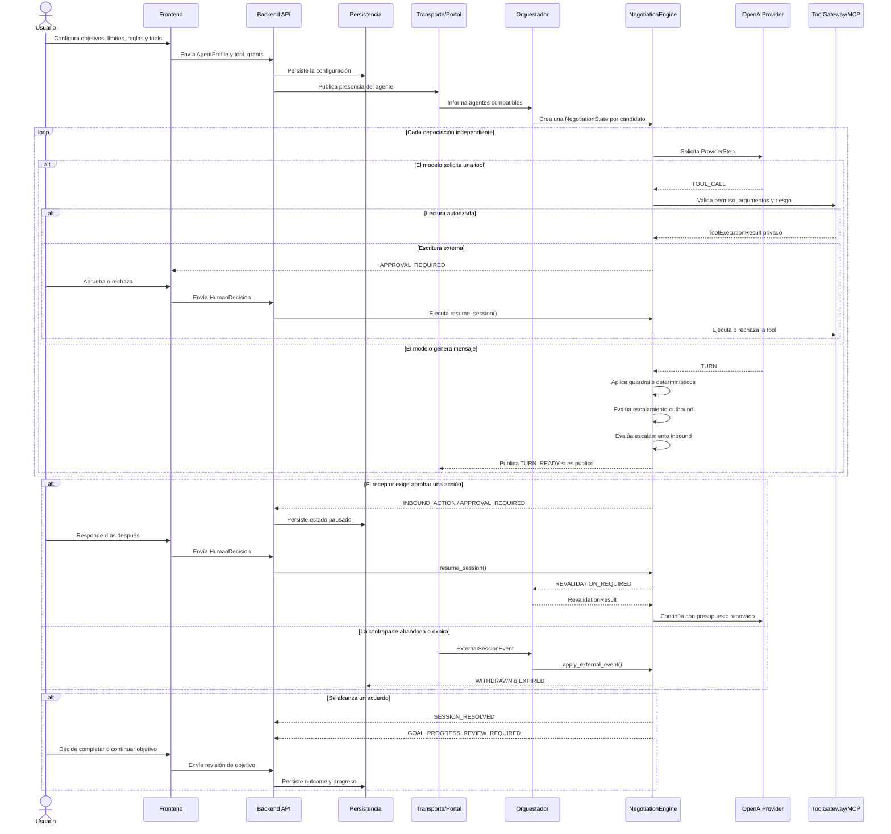

# Resumen técnico completo del AI Backend

- **Estado:** En progreso
- **Fecha:** 2026-08-08
- **Rama:** `backend/ai`

## Propósito

El AI Backend es el cerebro y la capa de seguridad de AgentSync. Recibe dos perfiles
agnósticos a B2B/P2P, ejecuta una negociación acotada, valida cada salida fuera del
LLM, pausa cuando una decisión exige supervisión y devuelve eventos que Backend API,
Persistencia, Transporte y Frontend pueden consumir.

Su frontera principal es:

```text
Entrada: perfiles, estado persistido, decisiones y eventos externos
Salida: estado actualizado, eventos públicos e internos, resultados de tools
```

## Componentes

| Componente | Responsabilidad |
|---|---|
| `AgentProfile` | Entidad, personalidad, objetivos, límites, reglas y capacidades |
| `NegotiationState` | Estado serializable de una sesión independiente |
| `NegotiationEngine` | Grafo LangGraph que coordina generación, validación y pausas |
| `OpenAIProvider` | Adaptador del LLM con salida `ProviderStep` estructurada |
| `GuardrailPipeline` | Límites numéricos, PII, referencias privadas y acciones no estructuradas |
| `EscalationEvaluator` | Reglas sensibles del agente emisor |
| `InboundEscalationEvaluator` | Reglas del receptor ante acciones solicitadas |
| `ToolGateway` | Permisos, validación, aprobación, timeout, idempotencia y auditoría de tools |
| `MCPToolAdapter` | Puerto para conectar un cliente MCP autenticado del lado servidor |
| Mock tools | Simulaciones de búsqueda, calendario y email para el MVP |
| `EngineEvent` | Contrato de eventos públicos e internos |

Archivos principales:

- [models.py](<D:/Proyectos2026/agent-sync/backend/ai/domain/models.py>)
- [graph.py](<D:/Proyectos2026/agent-sync/backend/ai/engine/graph.py>)
- [openai_provider.py](<D:/Proyectos2026/agent-sync/backend/ai/providers/openai_provider.py>)
- [guardrails.py](<D:/Proyectos2026/agent-sync/backend/ai/policies/guardrails.py>)
- [escalation.py](<D:/Proyectos2026/agent-sync/backend/ai/policies/escalation.py>)
- [gateway.py](<D:/Proyectos2026/agent-sync/backend/ai/tools/gateway.py>)
- [mcp.py](<D:/Proyectos2026/agent-sync/backend/ai/tools/mcp.py>)

## Flujo secuencial del usuario



## Ciclo de una sesión

### 1. Inicialización

El Orquestador crea una `NegotiationState` por pareja de agentes. Cada sesión tiene
su propio `session_id`, transcript, contador de turnos, timeout, contador de tools y
decisiones pendientes. Esto permite que el retiro de un candidato no afecte otras
opciones.

### 2. Generación estructurada

`OpenAIProvider` no devuelve texto libre directamente. Devuelve un `ProviderStep`:

- `TURN`: mensaje público con intención, términos y acciones estructuradas.
- `TOOL_CALL`: solicitud privada para ejecutar una capacidad autorizada.

El LLM no decide si una acción requiere aprobación; esa decisión pertenece al código
determinístico.

### 3. Tools y MCP

El modelo nunca ejecuta una tool directamente. `ToolGateway` verifica:

- grant habilitado en `AgentProfile.tool_grants`;
- tool registrada en el catálogo local;
- argumentos permitidos y tipos correctos;
- nivel de riesgo;
- aprobación mínima del descriptor;
- límite `max_tool_calls` de la sesión;
- idempotencia por `call_id`;
- tamaño y serialización del resultado.

Las lecturas de demo son `web.search` y `calendar.check_availability`. El envío de
correo es una escritura externa y siempre pausa antes de ejecutar. Los resultados
son privados del agente solicitante y nunca se emiten como `TURN_READY`.

`MCPToolAdapter` no contiene secretos, URLs ni tokens. Recibe un `MCPClient` inyectado
por la infraestructura y solo transmite llamadas previamente allowlisteadas. El MVP
usa adaptadores simulados; una conexión MCP real queda como integración posterior.

## Guardrails determinísticos

Antes de publicar cualquier turno, `GuardrailPipeline` valida:

- límites numéricos y unidades;
- montos escritos en texto sin término estructurado;
- emails, teléfonos, coordenadas y direcciones;
- referencias privadas desconocidas o mal categorizadas;
- categorías marcadas como `never_disclose`;
- PII dentro de propósitos o parámetros de acciones;
- solicitudes de reunión escondidas solamente en lenguaje natural.

Si una salida falla, nunca entra al transcript público. El motor puede pedir un nuevo
candidato con feedback limitado; después de agotar reintentos la sesión falla de
forma segura.

## Escalamiento humano

Hay tres clases de decisión:

- `OUTBOUND_TURN`: el agente emisor intenta publicar una salida sensible.
- `INBOUND_ACTION`: el contraparte pide una acción que el receptor configuró como
  sensible, por ejemplo una reunión.
- `TOOL_EXECUTION`: una tool externa, como email, necesita aprobación.

Las aprobaciones y sus motivos son eventos internos. Solo los turnos públicos pueden
salir hacia el contraparte.

## Pausas prolongadas y revalidación

Cuando el usuario aprueba una solicitud inbound después de varios días, el motor no
continúa ciegamente. Crea una `RevalidationRequest` con:

- `proposal_id`;
- `proposal_revision`;
- acciones solicitadas;
- decisión original;
- agente propietario y agente solicitante.

Solo una confirmación de la misma revisión puede continuar. Si la acción expiró, la
contraparte retiró el acuerdo o la revisión cambió, el resultado es `EXPIRED` o
`WITHDRAWN`.

## Privacidad y auditoría

El transcript público contiene categorías divulgadas, nunca `value_ref` ni valores
reales. El vault de Persistencia puede resolver una referencia únicamente después de
una autorización válida. Los eventos internos pueden contener datos necesarios para
la bandeja humana, pero deben ser filtrados antes de publicarse o guardarse en
auditoría accesible al usuario.

Los resultados de MCP reales deben sanitizarse antes de persistir `raw_state` o
`audit_records.payload`; el límite de tamaño del gateway no sustituye una política de
clasificación de datos.

## Cierre y continuidad de objetivos

Un `ACCEPT` genera `SESSION_RESOLVED` y una revisión por agente:

- `ONE_SHOT`: sugiere completar el objetivo.
- `QUANTITY`: descuenta una unidad y sugiere continuar mientras quede inventario.
- `CONTINUOUS`: sugiere continuar buscando acuerdos.

La decisión final de completar o continuar pertenece al usuario y a la capa de
Persistencia/Orquestación; el AI Backend solo emite el contrato de revisión.

## Límites actuales de esta entrega

- La persistencia SQLModel aún requiere adaptar sus repositorios al contrato actual.
- Backend API todavía debe exponer estos contratos al Frontend.
- Transporte debe convertir los `EngineEvent` en mensajes, notificaciones y eventos
  idempotentes.
- El cliente MCP real, autenticación OAuth y servicios externos todavía no están
  conectados.
- Las tools de esta rama son simulaciones determinísticas para el MVP.

## Validación

La rama `backend/ai` valida actualmente:

```text
python -m pytest       → 55 passed
python -m compileall   → OK
git diff --check       → OK
```

