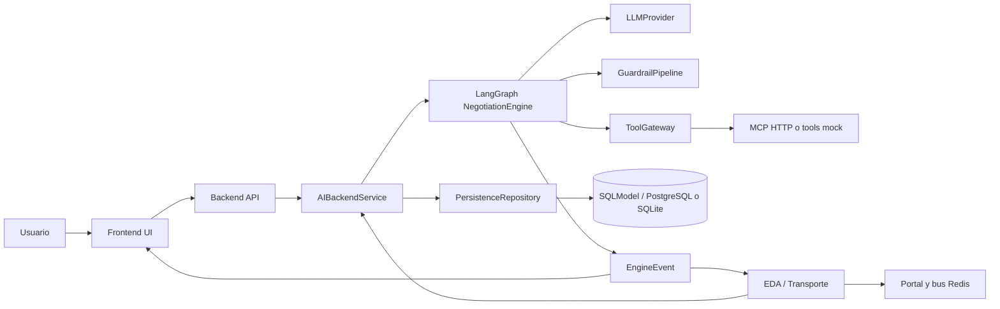
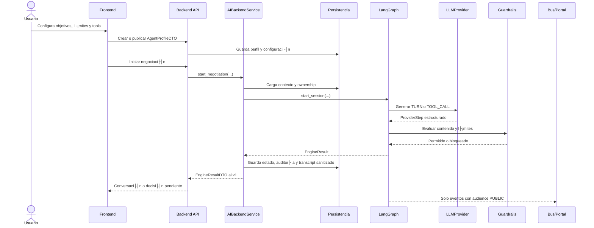
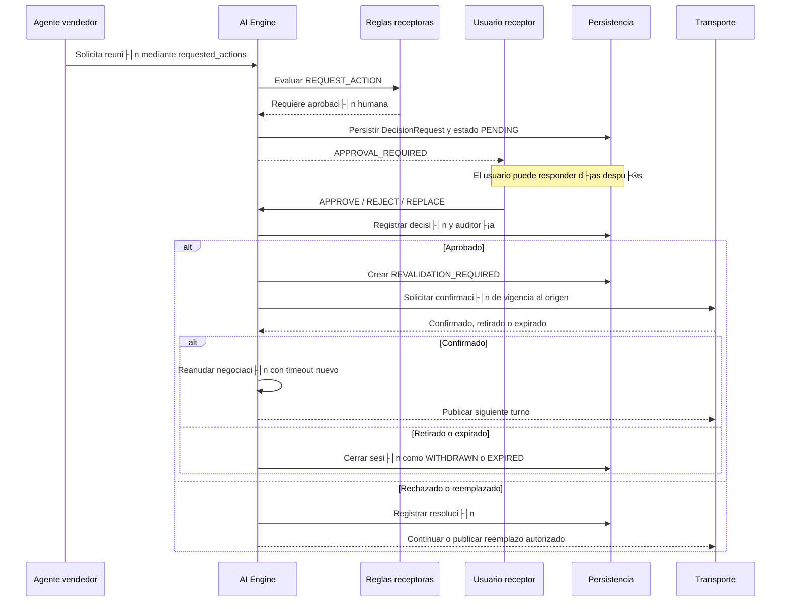
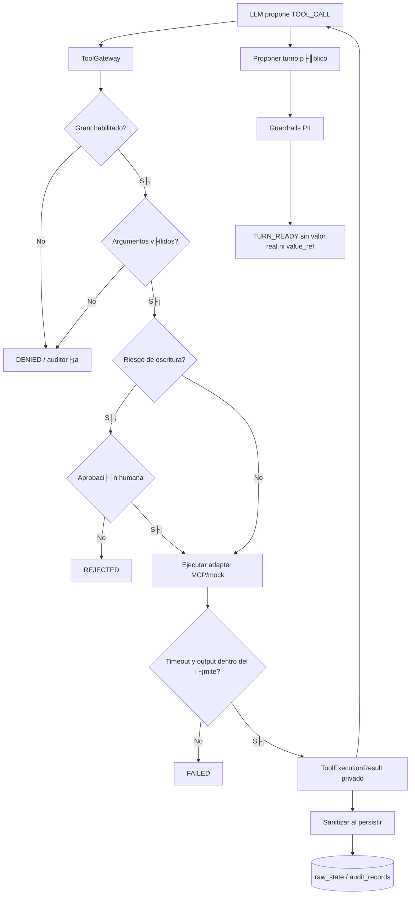
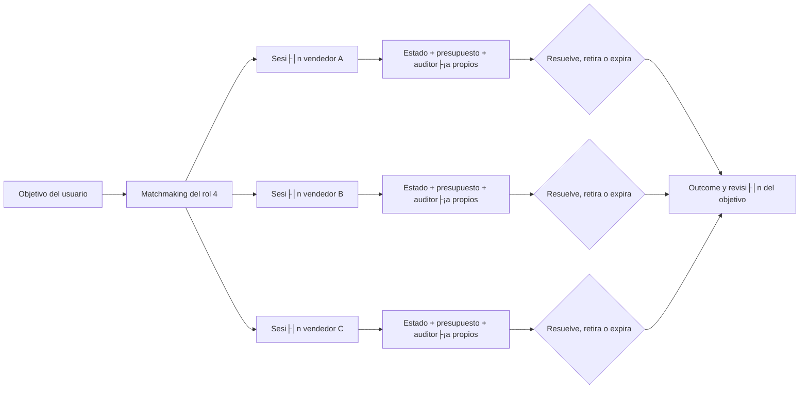

# Capacidades e integraci├│n del AI Backend

- **Estado:** Completada (corte de integraci├│n)
- **Fecha:** 2026-08-08
- **Rama donde se documenta:** `main`
- **Versi├│n AI revisada:** `backend/ai` en `55263`

## Prop├│sito del componente

El AI Backend es el rol 2 del proyecto: ejecuta el razonamiento acotado de los agentes, aplica las reglas de seguridad fuera del LLM, controla tools y convierte cada transici├│n en eventos y DTOs consumibles por el resto del sistema.

No es due├▒o de las pantallas, del bus de transporte ni del esquema relacional completo. Su responsabilidad es exponer contratos estables para que esos componentes puedan invocar el cerebro sin duplicar sus reglas.

## Capacidades entregadas

### Motor de conversaci├│n

- Grafo LangGraph para dos agentes.
- Proveedor LLM detrás de `LLMProvider`.
- Proveedor OpenAI con salida estructurada `ProviderStep`.
- Proveedor guionado/offline para pruebas y demos.
- Máximo de turnos configurable.
- Timeout de sesi├│n configurable.
- Timeout duro por cada llamada al proveedor.
- Reintentos acotados de guardrails.
- Estados terminales explícitos: `RESOLVED`, `REJECTED`, `WITHDRAWN`, `EXPIRED` y `FAILED`.

### Guardrails y privacidad

- L├¡mites num├®ricos determin├¡sticos antes de publicar un turno.
- Bloqueo de precios, monedas y compromisos no estructurados.
- Detecci├│n de tel├®fonos, emails, ubicaciones y direcciones.
- Separaci├│n entre `data_requests` y `proposed_disclosures`.
- Validaci├│n de referencias privadas contra el vault del agente.
- Bloqueo de referencias opacas inventadas o expuestas en texto p├║blico.
- Reglas de `never_disclose`.
- Validaci├│n de acciones estructuradas como reuniones, reservas y emails.
- El LLM nunca decide por sí mismo si una acción requiere aprobación.

### Escalamiento y supervisi├│n humana

- Reglas de precio final, umbral, datos personales y compromisos.
- Evaluaci├│n outbound: lo que el agente quiere publicar.
- Evaluaci├│n inbound: lo que el contraparte solicita.
- Bandeja de decisiones con `APPROVE`, `REJECT` y `REPLACE`.
- Revalidaci├│n de propuestas despu├®s de una espera humana prolongada.
- Expiraci├│n o retiro del contraparte sin afectar otras sesiones.
- Autorizaciones explícitas para acciones sensibles.
- Revisi├│n posterior del objetivo: completar o continuar buscando acuerdos.

### Tools y MCP

- `ToolGateway` como ├║nico punto de ejecuci├│n.
- Grants por agente y allowlist de capabilities.
- Validaci├│n de nombre, argumentos, tipos y longitud.
- Aprobaci├│n obligatoria para operaciones externas de escritura.
- Idempotencia por `session_id`, `agent_id` y `call_id`.
- Timeout por tool y límite de tamaño de respuesta.
- Adaptadores simulados para b├║squeda, calendario y correo.
- Cliente MCP HTTP server-side con autenticaci├│n por variable de entorno.
- Allowlist opcional por servidor MCP.
- Validaci├│n JSON-RPC, correlaci├│n de respuesta y soporte JSON/SSE.
- Los resultados se sanitizan antes de persistirse.

### Límites y operación

- Rate limit por usuario.
- Coste LLM estimado por usuario y ventana horaria.
- Tiempo máximo de ejecución por sesión.
- Máximo de llamadas a tools por sesión.
- Configuraci├│n por entorno para proveedor, modelo, MCP, secretos y base de datos.
- Logs estructurados de LLM, tools y eventos sin transcript ni PII.
- `correlation_id`, `event_id` y duraci├│n para observabilidad.

El presupuesto actual es local al proceso. En despliegues con varios workers debe sustituirse por un ledger compartido en Redis o Persistencia.

### Contratos de API

Los modelos internos no se exponen directamente. El m├│dulo `ai.api.dto` publica:

- `AgentProfileDTO` para la configuraci├│n del agente.
- `NegotiationStateDTO` para el estado visible al propietario.
- `DecisionRequestDTO` para la bandeja de decisiones.
- `PublicTranscriptMessageDTO` para el transcript p├║blico.
- `EngineEventDTO` para eventos con audiencia y correlaci├│n.
- `EngineResultDTO` como respuesta versionada `ai.v1`.
- `HumanDecisionDTO` para aprobar, rechazar o reemplazar.

## Diagrama de límites del sistema



La flecha de retorno desde Transporte hacia `AIBackendService` representa el worker de integraci├│n: recibe un evento autenticado, carga la sesi├│n y ejecuta el siguiente paso del motor.

## Flujo t├®cnico de una negociaci├│n



## Flujo de acción sensible y espera tardía



## Flujo de tools y frontera de PII



El resultado de una tool puede ser contexto privado del agente, pero nunca se convierte automáticamente en mensaje público. La publicación necesita pasar otra vez por guardrails y por el control de audiencia del evento.

## Flujo de varias negociaciones simultáneas



Cada sesi├│n tiene su propio `session_id`, transcript, contador de turnos, presupuesto, decisiones y eventos procesados. Un retiro o timeout no debe cancelar las sesiones hermanas.

## Integraci├│n por rol

| Rol | Consume del AI Backend | Entrega al AI Backend | Restricciones |
|---|---|---|---|
| **1. Frontend UI** | `AgentProfileDTO`, `NegotiationStateDTO`, `DecisionRequestDTO`, `EngineResultDTO`, transcript p├║blico | Configuraci├│n, `HumanDecisionDTO`, revalidaciones y revisi├│n de objetivos | Nunca ejecuta LLM/tools ni decide guardrails. |
| **2. AI Backend** | Perfil, estado cargado y eventos externos autenticados | Eventos AI, decisiones, resultados y auditoría | Es dueño del razonamiento, políticas y tools. |
| **3. Transporte/Integraci├│n** | `EngineEventDTO` p├║blico y comandos de publicaci├│n | Webhooks normalizados, eventos Redis y resultados de Portal | No decide reglas AI ni resultados de negociaci├│n. |
| **4. Dominio/Persistencia/Orquestaci├│n** | Estado persistido, ownership, historial y outcomes | Matchmaking, lifecycle, repositorio y control de concurrencia | No duplica guardrails ni l├│gica del LLM. |

## Contratos de invocaci├│n

La capa de integraci├│n debe llamar al AI mediante una fachada estable:

```python
service.start_negotiation(user_id, agent_a, agent_b)
service.resume_negotiation(user_id, session_id, human_decision)
service.apply_revalidation(user_id, session_id, revalidation)
service.apply_external_event(user_id, session_id, external_event)
service.get_negotiation(user_id, session_id)
```

La implementaci├│n interna puede usar LangGraph, pero EDA, API y Frontend no deben importar nodos del grafo directamente.

## Reglas de publicaci├│n de eventos

1. `TURN_READY` es el ├║nico evento que puede llegar como mensaje al contraparte y solo si `audience=PUBLIC`.
2. `APPROVAL_REQUIRED`, `CANDIDATE_BLOCKED`, `REVALIDATION_REQUIRED`, auditorías y resultados de tools son internos.
3. Todos los eventos deben conservar `event_id`, `correlation_id`, `session_id`, `event_type`, `audience` y `occurred_at`.
4. El worker confirma el mensaje del bus despu├®s de persistir el resultado, no antes.
5. Un webhook duplicado debe ser idempotente y no generar un segundo turno.
6. Los mensajes publicados por el propio backend deben poder distinguirse para evitar loops de eco.

## Criterio de integraci├│n completa

El rol 2 estará completamente integrado cuando pueda demostrarse este recorrido:

```text
Frontend configura agente
   API valida y persiste perfil
   Matchmaking encuentra candidatos
   Transporte entrega evento autenticado
  ÔåÆ Worker carga sesi├│n
   AI ejecuta LLM + guardrails + tools
  ÔåÆ Persistencia guarda estado y auditor├¡a
  ÔåÆ Frontend recibe conversaci├│n o aprobaci├│n
  ÔåÆ Usuario responde incluso d├¡as despu├®s
  ÔåÆ AI revalida o cierra la sesi├│n
  ÔåÆ Portal recibe ├║nicamente el siguiente evento p├║blico
```

