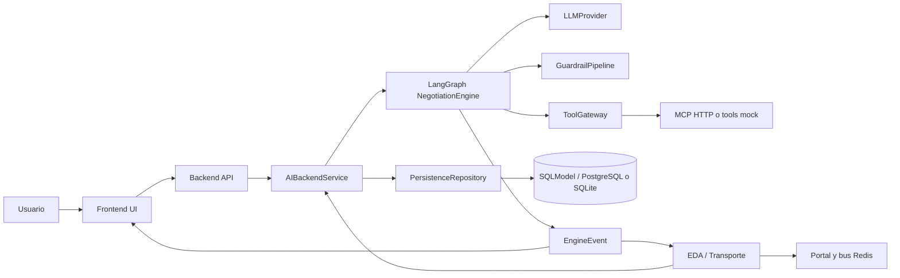
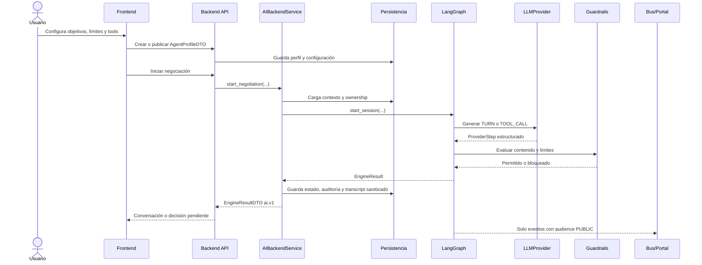
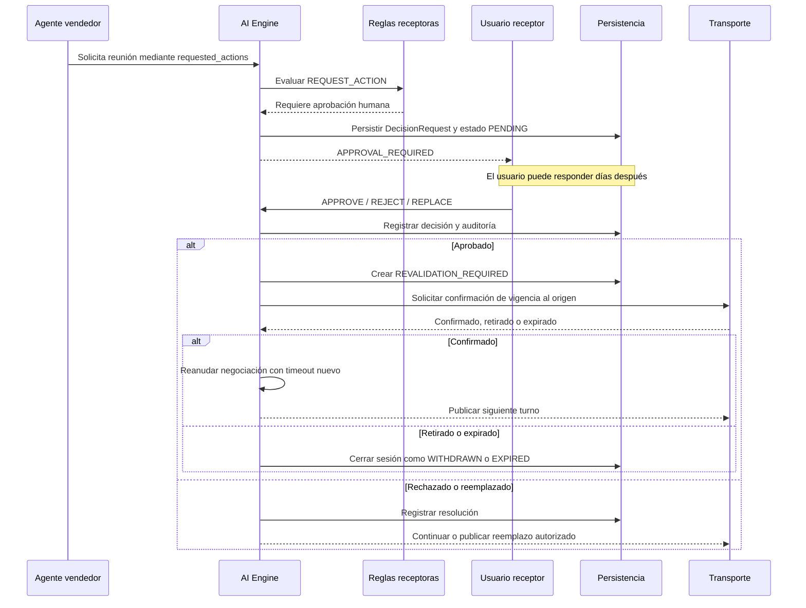
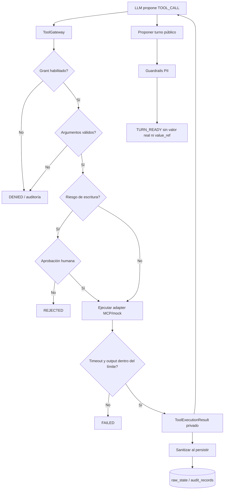
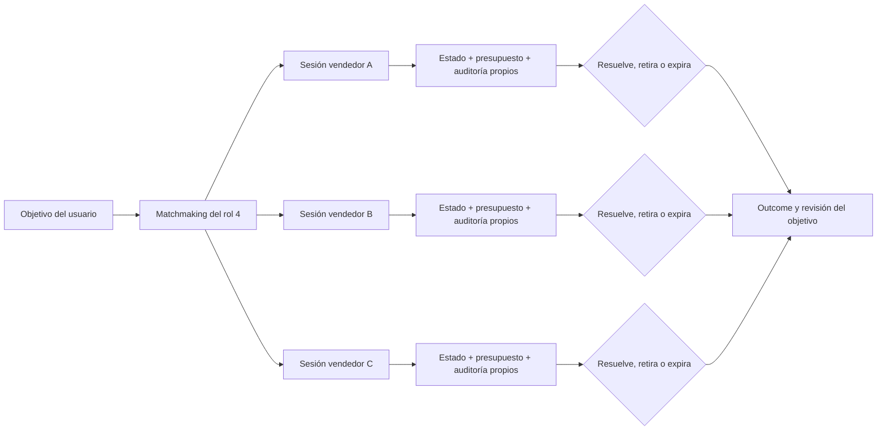

# Capacidades e integración del AI Backend

- **Estado:** Completada (corte de integración)
- **Fecha:** 2026-08-08
- **Rama donde se documenta:** `main`
- **Versión AI revisada:** `backend/ai` en `55263`

## Propósito del componente

El AI Backend es el rol 2 del proyecto: ejecuta el razonamiento acotado de los agentes, aplica las reglas de seguridad fuera del LLM, controla tools y convierte cada transición en eventos y DTOs consumibles por el resto del sistema.

No es dueño de las pantallas, del bus de transporte ni del esquema relacional completo. Su responsabilidad es exponer contratos estables para que esos componentes puedan invocar el cerebro sin duplicar sus reglas.

## Capacidades entregadas

### Motor de conversación

- Grafo LangGraph para dos agentes.
- Proveedor LLM detrás de `LLMProvider`.
- Proveedor OpenAI con salida estructurada `ProviderStep`.
- Proveedor guionado/offline para pruebas y demos.
- Máximo de turnos configurable.
- Timeout de sesión configurable.
- Timeout duro por cada llamada al proveedor.
- Reintentos acotados de guardrails.
- Estados terminales explícitos: `RESOLVED`, `REJECTED`, `WITHDRAWN`, `EXPIRED` y `FAILED`.

### Guardrails y privacidad

- Límites numéricos determinísticos antes de publicar un turno.
- Bloqueo de precios, monedas y compromisos no estructurados.
- Detección de teléfonos, emails, ubicaciones y direcciones.
- Separación entre `data_requests` y `proposed_disclosures`.
- Validación de referencias privadas contra el vault del agente.
- Bloqueo de referencias opacas inventadas o expuestas en texto público.
- Reglas de `never_disclose`.
- Validación de acciones estructuradas como reuniones, reservas y emails.
- El LLM nunca decide por sí mismo si una acción requiere aprobación.

### Escalamiento y supervisión humana

- Reglas de precio final, umbral, datos personales y compromisos.
- Evaluación outbound: lo que el agente quiere publicar.
- Evaluación inbound: lo que el contraparte solicita.
- Bandeja de decisiones con `APPROVE`, `REJECT` y `REPLACE`.
- Revalidación de propuestas después de una espera humana prolongada.
- Expiración o retiro del contraparte sin afectar otras sesiones.
- Autorizaciones explícitas para acciones sensibles.
- Revisión posterior del objetivo: completar o continuar buscando acuerdos.

### Tools y MCP

- `ToolGateway` como único punto de ejecución.
- Grants por agente y allowlist de capabilities.
- Validación de nombre, argumentos, tipos y longitud.
- Aprobación obligatoria para operaciones externas de escritura.
- Idempotencia por `session_id`, `agent_id` y `call_id`.
- Timeout por tool y límite de tamaño de respuesta.
- Adaptadores simulados para búsqueda, calendario y correo.
- Cliente MCP HTTP server-side con autenticación por variable de entorno.
- Allowlist opcional por servidor MCP.
- Validación JSON-RPC, correlación de respuesta y soporte JSON/SSE.
- Los resultados se sanitizan antes de persistirse.

### Límites y operación

- Rate limit por usuario.
- Coste LLM estimado por usuario y ventana horaria.
- Tiempo máximo de ejecución por sesión.
- Máximo de llamadas a tools por sesión.
- Configuración por entorno para proveedor, modelo, MCP, secretos y base de datos.
- Logs estructurados de LLM, tools y eventos sin transcript ni PII.
- `correlation_id`, `event_id` y duración para observabilidad.

El presupuesto actual es local al proceso. En despliegues con varios workers debe sustituirse por un ledger compartido en Redis o Persistencia.

### Contratos de API

Los modelos internos no se exponen directamente. El módulo `ai.api.dto` publica:

- `AgentProfileDTO` para la configuración del agente.
- `NegotiationStateDTO` para el estado visible al propietario.
- `DecisionRequestDTO` para la bandeja de decisiones.
- `PublicTranscriptMessageDTO` para el transcript público.
- `EngineEventDTO` para eventos con audiencia y correlación.
- `EngineResultDTO` como respuesta versionada `ai.v1`.
- `HumanDecisionDTO` para aprobar, rechazar o reemplazar.

## Diagrama de límites del sistema



La flecha de retorno desde Transporte hacia `AIBackendService` representa el worker de integración: recibe un evento autenticado, carga la sesión y ejecuta el siguiente paso del motor.

## Flujo técnico de una negociación



## Flujo de acción sensible y espera tardía



## Flujo de tools y frontera de PII



El resultado de una tool puede ser contexto privado del agente, pero nunca se convierte automáticamente en mensaje público. La publicación necesita pasar otra vez por guardrails y por el control de audiencia del evento.

## Flujo de varias negociaciones simultáneas



Cada sesión tiene su propio `session_id`, transcript, contador de turnos, presupuesto, decisiones y eventos procesados. Un retiro o timeout no debe cancelar las sesiones hermanas.

## Integración por rol

| Rol | Consume del AI Backend | Entrega al AI Backend | Restricciones |
|---|---|---|---|
| **1. Frontend UI** | `AgentProfileDTO`, `NegotiationStateDTO`, `DecisionRequestDTO`, `EngineResultDTO`, transcript público | Configuración, `HumanDecisionDTO`, revalidaciones y revisión de objetivos | Nunca ejecuta LLM/tools ni decide guardrails. |
| **2. AI Backend** | Perfil, estado cargado y eventos externos autenticados | Eventos AI, decisiones, resultados y auditoría | Es dueño del razonamiento, políticas y tools. |
| **3. Transporte/Integración** | `EngineEventDTO` público y comandos de publicación | Webhooks normalizados, eventos Redis y resultados de Portal | No decide reglas AI ni resultados de negociación. |
| **4. Dominio/Persistencia/Orquestación** | Estado persistido, ownership, historial y outcomes | Matchmaking, lifecycle, repositorio y control de concurrencia | No duplica guardrails ni lógica del LLM. |

## Contratos de invocación

La capa de integración debe llamar al AI mediante una fachada estable:

```python
service.start_negotiation(user_id, agent_a, agent_b)
service.resume_negotiation(user_id, session_id, human_decision)
service.apply_revalidation(user_id, session_id, revalidation)
service.apply_external_event(user_id, session_id, external_event)
service.get_negotiation(user_id, session_id)
```

La implementación interna puede usar LangGraph, pero EDA, API y Frontend no deben importar nodos del grafo directamente.

## Reglas de publicación de eventos

1. `TURN_READY` es el único evento que puede llegar como mensaje al contraparte y solo si `audience=PUBLIC`.
2. `APPROVAL_REQUIRED`, `CANDIDATE_BLOCKED`, `REVALIDATION_REQUIRED`, auditorías y resultados de tools son internos.
3. Todos los eventos deben conservar `event_id`, `correlation_id`, `session_id`, `event_type`, `audience` y `occurred_at`.
4. El worker confirma el mensaje del bus después de persistir el resultado, no antes.
5. Un webhook duplicado debe ser idempotente y no generar un segundo turno.
6. Los mensajes publicados por el propio backend deben poder distinguirse para evitar loops de eco.

## Criterio de integración completa

El rol 2 estará completamente integrado cuando pueda demostrarse este recorrido:

```text
Frontend configura agente
  → API valida y persiste perfil
  → Matchmaking encuentra candidatos
  → Transporte entrega evento autenticado
  → Worker carga sesión
  → AI ejecuta LLM + guardrails + tools
  → Persistencia guarda estado y auditoría
  → Frontend recibe conversación o aprobación
  → Usuario responde incluso días después
  → AI revalida o cierra la sesión
  → Portal recibe únicamente el siguiente evento público
```

