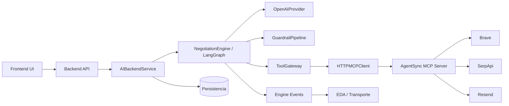

# Integración nativa del AI Backend con el MCP Server

- **Estado:** Completada
- **Fecha:** 2026-08-09
- **Rama donde se toma la decisión:** `main`
- **Rama de código revisada:** `backend/ai` (`82b18`)

## Contexto

AgentSync separa el razonamiento del agente de las credenciales y conexiones a
servicios externos. El AI Backend debe poder usar el servidor MCP propio sin
construir una integración HTTP específica para cada proveedor.

## Decisión

El AI Backend soporta de forma nativa el servidor MCP de AgentSync mediante
`HTTPMCPClient`, `MCPToolAdapter` y `ToolGateway`.

El servidor MCP es responsable de:

- Mantener las API keys de Brave, SerpApi y Resend.
- Ejecutar las llamadas externas.
- Validar entradas específicas del proveedor.
- Sanitizar las respuestas antes de devolverlas.
- Exponer las tools por Streamable HTTP.

El AI Backend es responsable de:

- Decidir si el agente tiene grant para la tool.
- Validar nombres, tipos y tamaños de argumentos.
- Aplicar guardrails y políticas del usuario.
- Exigir aprobación humana para escrituras externas.
- Aplicar timeouts, idempotencia, rate limits y presupuesto.
- Persistir el resultado y generar eventos/DTOs.

## Flujo de componentes

## Compatibilidad comprobada

El cliente del AI Backend y el servidor MCP comparten:

- Transporte Streamable HTTP.
- JSON-RPC `tools/call`.
- Versión de protocolo `2026-07-28`.
- Cabeceras `MCP-Protocol-Version`, `mcp-method` y `mcp-name`.
- Envelope `_meta` con información del cliente.
- Respuestas `structuredContent`.
- `X-Idempotency-Key` en el cliente y `Idempotency-Key` hacia Resend.
- Bearer token opcional configurado por nombre de variable de entorno.

## Tools disponibles en el MVP

| Tool | Riesgo AI Backend | Proveedor actual |
| --- | --- | --- |
| `web.search` | Lectura | Brave |
| `market.reference_prices` | Lectura | SerpApi |
| `email.send_notification` | Escritura externa; aprobación obligatoria | Resend |

El logo del correo es responsabilidad del servidor MCP. El AI Backend solo
envía `to`, `subject` y `body`; no necesita conocer el asset ni las
credenciales de Resend.

## Consecuencias y límites

- La integración no depende de LangChain para transportar tools; el límite
  interno es `ToolGateway` y el transporte remoto es MCP.
- El catálogo se registra explícitamente en `build_mcp_tool_gateway`. Agregar
  una tool al servidor MCP requiere agregar también su descriptor y adapter en
  el AI Backend.
- `tools/list` sirve para diagnóstico, pero no habilita automáticamente una
  tool. La ejecución sigue restringida al catálogo y a los grants del agente.
- En un despliegue multiworker, los presupuestos locales deben migrarse a un
  ledger compartido para mantener límites globales.

## Referencias de código

- `backend/ai/tools/mcp_http.py`
- `backend/ai/tools/mcp.py`
- `backend/ai/service.py`
- `backend/mcp_servers/agentsync/server.py`
- `backend/mcp_servers/agentsync/upstream.py`
- `backend/mcp_servers/agentsync/assets/agentsync-logo.png`
