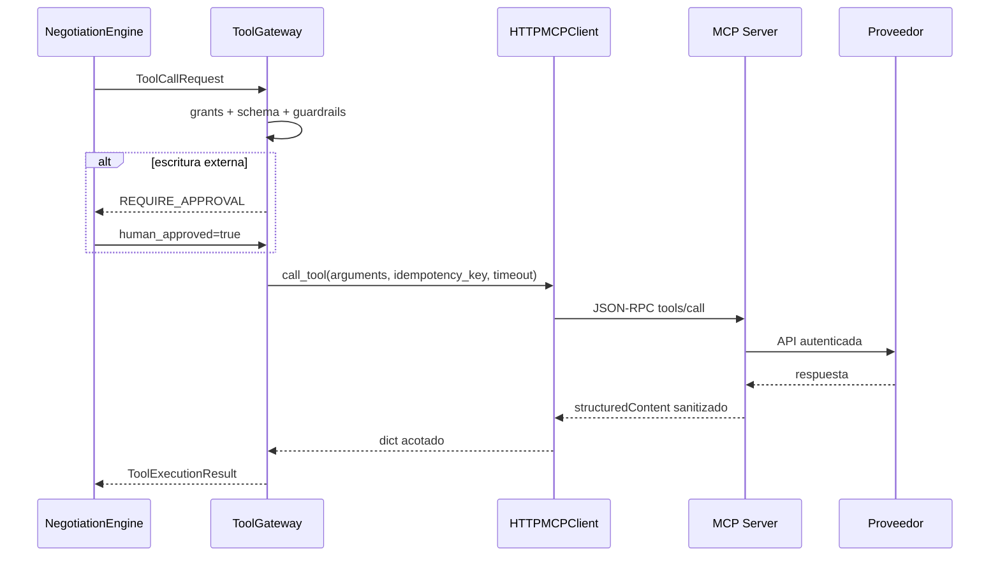

# Contrato versionado de tools MCP del MVP

- **Estado:** Aceptada
- **Fecha:** 2026-08-09
- **Rama donde se toma la decisión:** `main`
- **Rama de código revisada:** `backend/ai` (`82b18`)

## Propósito

Este documento fija el contrato que permite conectar el AI Backend con el
servidor MCP sin acoplar el motor de conversación a un proveedor externo.

## Configuración del servidor

El AI Backend lee `AGENTSYNC_MCP_SERVERS_JSON` desde su entorno. El valor no
contiene secretos; solo identifica endpoints, allowlists y nombres de
variables que contienen tokens.

Configuración local:

```dotenv
AGENTSYNC_TOOLS_PROVIDER=mcp
AGENTSYNC_MCP_DEFAULT_SERVER=default
AGENTSYNC_MCP_SERVERS_JSON={"default":{"endpoint":"http://127.0.0.1:8001/mcp","allowed_tools":["web.search","market.reference_prices","email.send_notification"]}}
```

Configuración con MCP separado y autenticado:

```dotenv
AGENTSYNC_MCP_SERVERS_JSON={"default":{"endpoint":"https://mcp.internal.example/mcp","token_env_var":"MCP_SERVER_TOKEN","allowed_tools":["web.search","market.reference_prices","email.send_notification"]}}
```

El token se configura en `MCP_SERVER_TOKEN` dentro del entorno del AI Backend.
El MCP Server usa el mismo secreto mediante
`AGENTSYNC_MCP_AUTH_TOKEN_ENV=MCP_SERVER_TOKEN`.

## Contratos de entrada

### `web.search`

```json
{
  "query": "lote de tela organica Colombia"
}
```

`query` es obligatorio y tiene un máximo de 300 caracteres.

### `market.reference_prices`

```json
{
  "item": "tela organica por lote",
  "region": "Colombia",
  "currency": "USD"
}
```

`item` es obligatorio. `region` y `currency` son opcionales; el servidor
normaliza la moneda a mayúsculas.

### `email.send_notification`

```json
{
  "to": "contacto@example.com",
  "subject": "Decision pendiente",
  "body": "Tu agente requiere una respuesta."
}
```

`to`, `subject` y `body` son obligatorios. El destinatario es un argumento de
la llamada, no una variable global del servidor. El servidor valida el formato
del email y el AI Backend exige aprobación humana porque es una escritura
externa.

## Contratos de salida

Las respuestas exitosas usan `structuredContent` y se reducen a datos mínimos:

```json
{
  "delivery_id": "provider-id",
  "status": "accepted"
}
```

Los errores son códigos estables (`MCP_NETWORK_ERROR`,
`MCP_REMOTE_TOOL_ERROR`, `UPSTREAM_TOKEN_NOT_CONFIGURED`,
`INVALID_EMAIL_RECIPIENT`, entre otros). No se propagan API keys, cuerpos
completos de proveedores ni PII innecesaria.

## Secuencia de ejecución



## Regla de extensibilidad

Una nueva tool debe cambiarse en ambos lados:

1. Definir el schema y la implementación en `backend/mcp_servers`.
2. Agregar el nombre a `allowed_tools` del entorno desplegado.
3. Crear `ToolDescriptor` y `MCPToolAdapter` en `backend/ai/tools/mcp.py`.
4. Definir riesgo, aprobación, límites y sanitización.
5. Añadir prueba de contrato y actualizar este documento.

No se permite que el LLM ejecute nombres descubiertos dinámicamente sin pasar
por el descriptor y las políticas del AI Backend.
