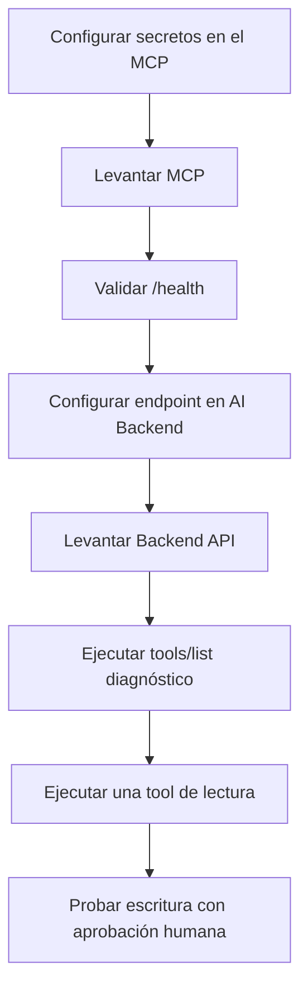

# Configuración y despliegue del MCP para el AI Backend

- **Estado:** Completada para el MVP
- **Fecha:** 2026-08-09
- **Rama donde se toma la decisión:** `main`
- **Rama de código revisada:** `backend/ai` (`82b18`)

## Objetivo

Definir cómo levantar el servidor MCP, conectar el AI Backend y separar la
configuración de proveedores de la configuración del agente.

## Variables por proceso

### AI Backend

```dotenv
AGENTSYNC_LLM_PROVIDER=openai
OPENAI_API_KEY=<solo-servidor>
AGENTSYNC_OPENAI_API_KEY_ENV=OPENAI_API_KEY
AGENTSYNC_TOOLS_PROVIDER=mcp
AGENTSYNC_MCP_DEFAULT_SERVER=default
AGENTSYNC_MCP_SERVERS_JSON={"default":{"endpoint":"http://127.0.0.1:8001/mcp","allowed_tools":["web.search","market.reference_prices","email.send_notification"]}}
```

### MCP Server

```dotenv
AGENTSYNC_MCP_HOST=127.0.0.1
AGENTSYNC_MCP_PORT=8001
AGENTSYNC_MCP_SEARCH_PROVIDER=brave
BRAVE_SEARCH_API_KEY=<solo-MCP>
AGENTSYNC_MCP_PRICES_PROVIDER=serpapi
SERPAPI_API_KEY=<solo-MCP>
AGENTSYNC_MCP_EMAIL_PROVIDER=resend
RESEND_API_KEY=<solo-MCP>
AGENTSYNC_MCP_EMAIL_FROM=agente@dominio-verificado.example
```

El destinatario del correo no se configura aquí: llega en el argumento `to`
de cada llamada autorizada.

## Arranque local

Desde `backend/`:

```powershell
uv sync
uv run uvicorn mcp_servers.agentsync.server:app --host 127.0.0.1 --port 8001
```

Comprobar salud:

```powershell
Invoke-RestMethod http://127.0.0.1:8001/health
```

La respuesta debe reportar `email: true`, los proveedores configurados y las
tres tools del MVP.

## Despliegue separado

Cuando el MCP vive en otro proceso o contenedor, el AI Backend cambia solo el
endpoint:

```dotenv
AGENTSYNC_MCP_SERVERS_JSON={"default":{"endpoint":"https://mcp.internal.example/mcp","token_env_var":"MCP_SERVER_TOKEN","allowed_tools":["web.search","market.reference_prices","email.send_notification"]}}
```

El endpoint debe incluir `/mcp`. Después de modificarlo se debe reiniciar el AI
Backend; la lista `allowed_tools` solo cambia si cambia el catálogo publicado.

## Orden recomendado



## Verificación de integración

1. `GET /health` responde `200`.
2. `tools/list` devuelve exactamente el catálogo esperado.
3. `web.search` funciona con el secreto de Brave.
4. `market.reference_prices` funciona con SerpApi.
5. `email.send_notification` permanece bloqueada hasta la aprobación humana.
6. El resultado de email solo expone `delivery_id` y `status`.
7. Los logs no contienen API keys, cuerpo completo ni PII innecesaria.

## Riesgos operativos

- No colocar secretos en `AGENTSYNC_MCP_SERVERS_JSON`, perfiles, prompts ni
  frontend.
- Si se habilita Bearer auth, el token debe existir en ambos procesos y nunca
  viajar en la URL.
- Un proceso MCP antiguo puede responder en el mismo puerto con un catálogo
  diferente. Si `/health` muestra tools históricas, detenerlo y reiniciar la
  versión de `backend/ai`.
- Un `status=accepted` de Resend confirma aceptación del proveedor; la entrega
  final debe revisarse en el evento del email y en el buzón destino.
