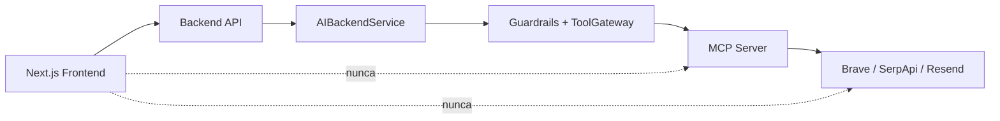
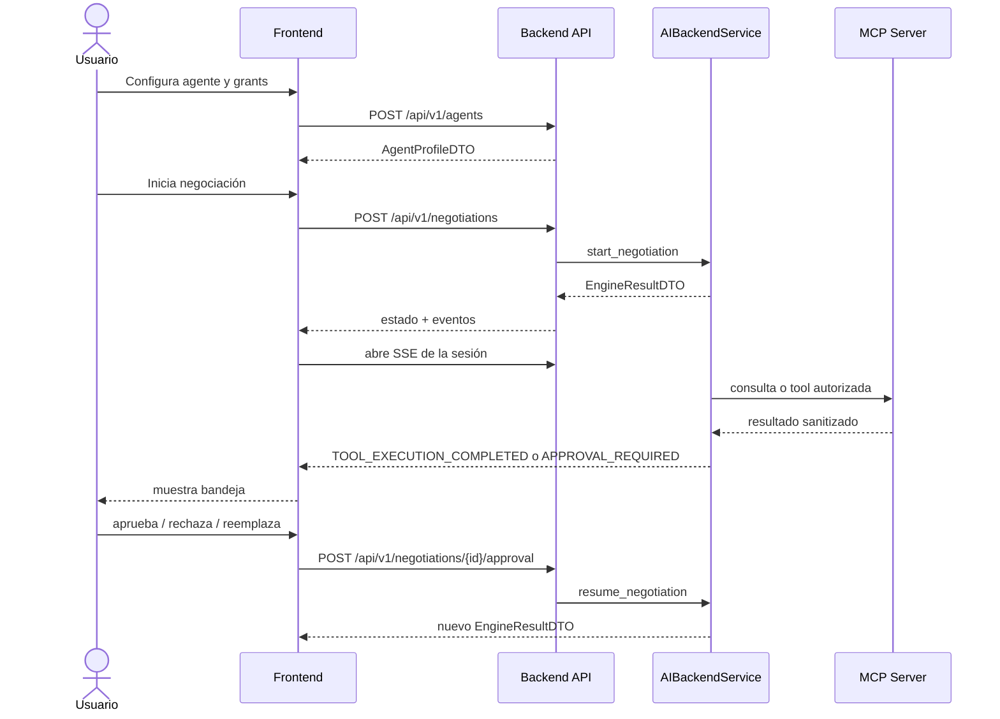

# Cambios de Frontend para integrar AI Backend y MCP

- **Estado:** En progreso
- **Fecha:** 2026-08-09
- **Rama donde se toma la decisión:** `main`
- **Rama de código AI revisada:** `backend/ai` (`82b18`)
- **Destinatario:** rol Frontend UI

## Objetivo

Conectar las pantallas del Frontend con el Backend API y el AI Backend sin
acceder directamente al servidor MCP, a OpenAI ni a proveedores externos.

El navegador solo conoce contratos `ai.v1`, estados de UI y DTOs sanitizados.
Las API keys, `AGENTSYNC_MCP_SERVERS_JSON`, prompts y guardrails permanecen en
el servidor.

## Regla de límites



No se debe colocar `OPENAI_API_KEY`, `RESEND_API_KEY`, `BRAVE_SEARCH_API_KEY`
ni `SERPAPI_API_KEY` en variables `NEXT_PUBLIC_*` o en el bundle del cliente.

## Cambios inmediatos

### 1. Configurar el cliente HTTP del Frontend

Usar una sola base URL para el Backend API:

```dotenv
NEXT_PUBLIC_API_BASE=http://localhost:8000
```

En producción, el navegador debe llamar al mismo origen o a un proxy seguro.
El Frontend debe conservar el header de identidad de agente que el Backend API
defina, por ejemplo `X-Agent-ID`, y manejar `401`, `403`, `409`, `422` y `429`
con estados visibles.

Archivos principales:

- `frontend/lib/api.ts`
- `frontend/lib/auth.tsx`
- `frontend/next.config.ts`

Rutas que el cliente debe centralizar en `frontend/lib/api.ts`:

| Método | Ruta | Uso |
| --- | --- | --- |
| `POST` | `/api/v1/agents` | Registrar/configurar agente |
| `GET` | `/api/v1/agents` | Cargar ecosistema |
| `GET` | `/api/v1/agents/{agent_id}` | Detalle de perfil |
| `POST` | `/api/v1/negotiations` | Iniciar negociación |
| `GET` | `/api/v1/negotiations` | Listar sesiones del propietario |
| `GET` | `/api/v1/negotiations/{session_id}` | Cargar detalle y transcript |
| `GET` | `/api/v1/negotiations/{session_id}/stream` | Recibir eventos SSE |
| `POST` | `/api/v1/negotiations/{session_id}/approval` | Resolver decisión humana |

Si el Backend API aún no expone una de estas rutas, el Frontend debe dejar el
adapter preparado y marcar la pantalla como `not connected`, no volver a los
mocks silenciosamente.

### 2. Alinear tipos con `ai.v1`

Las interfaces del Frontend deben reflejar los DTOs del AI Backend, no los
modelos internos ni un transcript inventado.

La respuesta de una negociación tiene esta forma conceptual:

```typescript
interface EngineResultDTO {
  schema_version: "ai.v1";
  state: NegotiationStateDTO;
  events: EngineEventDTO[];
}

interface NegotiationStateDTO {
  schema_version: "ai.v1";
  session_id: string;
  owner_user_id: string | null;
  status:
    | "SEARCHING"
    | "ACTIVE"
    | "PENDING_HUMAN_APPROVAL"
    | "RESOLVED"
    | "REJECTED"
    | "FAILED"
    | "WITHDRAWN"
    | "EXPIRED";
  current_speaker_id: string;
  turn_count: number;
  max_turns: number;
  deadline_at: string;
  pending_decision: DecisionRequestDTO | null;
  pending_revalidation: Record<string, unknown> | null;
  transcript: PublicTranscriptMessageDTO[];
  last_error_code: string | null;
}
```

Cada mapper debe conservar `proposal_id`, `proposal_revision`, `numeric_terms`,
`data_requests`, `requested_actions` y `approved_by_human`. Esos campos son
necesarios para explicar por qué un turno quedó detenido.

### 3. Reemplazar el store de mocks por carga y refresco real

`frontend/lib/store.tsx` debe:

- cargar agentes y negociaciones desde el Backend API;
- hidratar el detalle completo al abrir `/chat/[id]`;
- actualizar la sesión después de una aprobación;
- conservar `PENDING_HUMAN_APPROVAL` aunque el usuario cambie de pantalla;
- limpiar o marcar una decisión cuando el Backend devuelva `APPROVED`,
  `REJECTED` o `REPLACED`;
- mostrar `FAILED`, `EXPIRED` y `WITHDRAWN` como estados terminales, no como
  errores genéricos.

No se deben rellenar campos faltantes con datos simulados en producción. Si un
DTO no trae `summary`, `matchmaking` o `audit`, la UI debe mostrar un estado
vacío explícito.

### 4. Integrar la Bandeja de decisiones

La bandeja debe leer `state.pending_decision` o un endpoint equivalente de
decisiones pendientes. Debe mostrar:

- tipo (`kind`): turno saliente, acción entrante o ejecución de tool;
- razones y reglas coincidentes (`reasons`, `matched_rule_ids`);
- turno candidato o `tool_call` sanitizado;
- destinatario, asunto y resumen del email cuando la tool sea correo;
- fecha de creación y si requiere revalidación;
- acción disponible: aprobar, rechazar o reemplazar.

El envío de la decisión debe respetar `HumanDecisionDTO`:

```json
{
  "decision_id": "uuid-de-la-decision",
  "action": "APPROVE",
  "replacement_turn": null
}
```

Para reemplazar:

```json
{
  "decision_id": "uuid-de-la-decision",
  "action": "REPLACE",
  "replacement_turn": {
    "public_message": "Mensaje corregido por el propietario"
  }
}
```

El Frontend no debe enviar una dirección de correo fija ni intentar llamar
`email.send_notification` directamente. El `to` visible en la decisión debe
venir del DTO sanitizado y la aprobación debe regresar al AI Backend.

### 5. Integrar la vista de conversación

`frontend/app/chat/[id]/page.tsx` y `ConversationView` deben renderizar:

- transcript público ya sanitizado;
- intención del turno;
- términos numéricos y compromisos estructurados;
- solicitudes de datos sin revelar el valor real;
- indicador de turno aprobado por humano;
- evento de guardrail o tool bloqueada sin mostrar secretos;
- deadline, turno actual y máximo de turnos.

El Frontend no debe reconstruir el transcript desde `raw_state`. Ese campo es
diagnóstico interno y no es un contrato de presentación.

### 6. Conectar eventos en tiempo real

Usar SSE o el transporte que exponga el Backend API:

```text
GET /api/v1/negotiations/{session_id}/stream
```

Eventos mínimos que la UI debe reconocer:

- `APPROVAL_REQUIRED`;
- `DECISION_RESOLVED`;
- `REVALIDATION_REQUIRED`;
- `TOOL_EXECUTION_COMPLETED`;
- `TOOL_EXECUTION_DENIED`;
- `SESSION_RESOLVED`;
- `SESSION_REJECTED`;
- `SESSION_WITHDRAWN`;
- `SESSION_EXPIRED`;
- `SESSION_FAILED`.

La conexión debe reconectar con backoff y volver a consultar el detalle de la
sesión después de reconectar. Los estados terminales cierran el stream.

### 7. Configuración del agente y recursos permitidos

La pantalla de configuración debe editar el perfil, no variables del proceso.
Debe cubrir:

- personalidad;
- objetivos, intereses y capacidades;
- límites duros numéricos;
- categorías `never_disclose`;
- reglas de escalamiento;
- modo de cumplimiento del objetivo (`ONE_SHOT`, `QUANTITY`, `CONTINUOUS`);
- grants de tools.

Los recursos permitidos del diseño actual se mapean así:

| Recurso UI | Tool/backend | Riesgo |
| --- | --- | --- |
| Búsqueda de oportunidades | `web.search` | Lectura; puede depender de regla del usuario |
| Precios de referencia | `market.reference_prices` | Lectura |
| Notificaciones por correo | `email.send_notification` | Escritura; aprobación siempre |

No se debe presentar el correo como una capacidad de envío automático. La UI
debe indicar “requiere aprobación” y mostrar el destinatario antes de aprobar.

## Flujo completo para el Frontend



## Checklist de aceptación

- [ ] No existen API keys de proveedores en `frontend/`.
- [ ] El Frontend consume `schema_version: "ai.v1"`.
- [ ] La bandeja muestra razones y tool call sin PII real innecesaria.
- [ ] `email.send_notification` siempre presenta aprobación humana.
- [ ] Aprobar, rechazar y reemplazar envían `decision_id` correcto.
- [ ] El transcript usa `PublicTranscriptMessageDTO`.
- [ ] SSE reconecta y refresca la sesión.
- [ ] Se distinguen estados pendientes, terminales y errores recuperables.
- [ ] El flujo funciona igual para segmentos B2B y P2P.

## Referencias

- `backend/ai/api/dto.py`
- `backend/ai/service.py`
- `backend/ai/tools/mcp.py`
- `backend/ai/tools/mcp_http.py`
- `frontend/lib/api.ts`
- `frontend/lib/types.ts`
- `frontend/lib/store.tsx`
- `frontend/lib/sse.ts`
- `frontend/components/DecisionInbox.tsx`
- `frontend/components/ConversationView.tsx`
