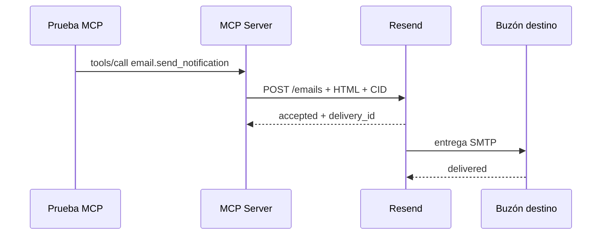

# Evidencia de integración MCP y Resend con branding

- **Estado:** Completada
- **Fecha:** 2026-08-09
- **Rama donde se toma la decisión:** `main`
- **Rama de código revisada:** `backend/ai` (`82b18`)

## Alcance de la prueba

Se ejecutó el servidor MCP actualizado en un puerto temporal, usando la
configuración real de Brave, SerpApi y Resend. La llamada se realizó mediante
MCP `tools/call`, no mediante un envío directo desde el frontend.

## Health check

El servidor reportó:

```json
{
  "configured_providers": {
    "search": true,
    "prices": true,
    "email": true
  },
  "tools": [
    "web.search",
    "market.reference_prices",
    "email.send_notification"
  ]
}
```

## Llamada comprobada

```json
{
  "name": "email.send_notification",
  "arguments": {
    "to": "<destinatario de prueba>",
    "subject": "AgentSync - prueba con logo correcto",
    "body": "Mensaje de prueba del servidor MCP."
  }
}
```

## Resultado observado

El MCP devolvió una respuesta estructurada con:

```json
{
  "status": "accepted",
  "delivery_id": "<id del proveedor>"
}
```

La consulta posterior al proveedor confirmó:

- destinatario correcto;
- remitente del dominio configurado;
- `last_event: delivered`;
- adjunto `agentsync-logo.png`;
- `content_disposition: inline`;
- `content_id: agentsync-logo`.

No se copian direcciones personales, API keys ni identificadores reales en
este documento.

## Interpretación

La prueba valida toda la cadena:



`accepted` indica que Resend recibió la solicitud. `delivered` indica que el
proveedor reportó entrega al servidor de destino; aun así, el mensaje puede
clasificarse en Spam, Promociones, cuarentena o una cuenta distinta.

## Regresión recomendada

Para repetir la prueba sin duplicar envíos innecesarios:

1. Validar `/health`.
2. Ejecutar una tool de lectura.
3. Confirmar que la escritura exige aprobación en `ToolGateway`.
4. Enviar una sola notificación.
5. Consultar el estado del `delivery_id` en Resend.
6. Buscar el remitente en `in:anywhere` del buzón destino.
