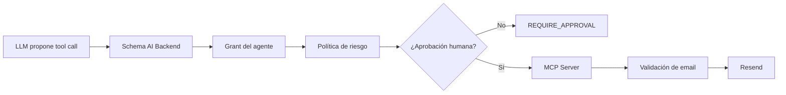
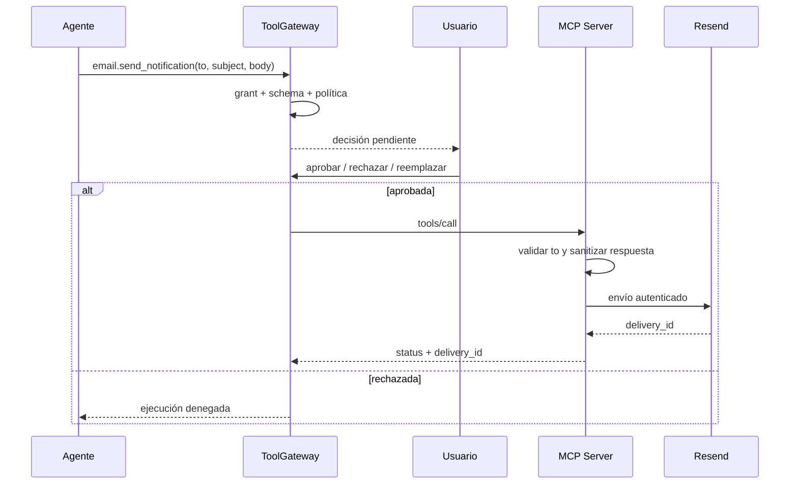

# Aprobación humana y destinatarios dinámicos en MCP

- **Estado:** Aceptada
- **Fecha:** 2026-08-09
- **Rama donde se toma la decisión:** `main`
- **Rama de código revisada:** `backend/ai` (`82b18`)

## Contexto

Enviar un correo modifica un sistema externo y puede divulgar información a un
tercero. Por eso el servidor MCP no debe asumir que todo destinatario es
seguro, aunque tenga formato válido.

## Capas de protección

## Reglas actuales del MVP

- `email.send_notification` está clasificada como `EXTERNAL_WRITE`.
- El `ToolGateway` exige aprobación humana en cada ejecución pendiente.
- `to` es obligatorio y tiene límite de longitud.
- El MCP Server rechaza formatos inválidos antes de llamar a Resend.
- `subject` y `body` se escapan al generar HTML para evitar inyección de
  markup en el correo.
- El destinatario se recibe por llamada; no existe un `EMAIL_TO` global.
- Las respuestas del proveedor se reducen a identificador de entrega y estado.
- Las credenciales viven exclusivamente en el entorno del MCP Server.

## Flujo de una decisión sensible

## Trabajo pendiente para producción

La validación actual comprueba sintaxis, pero no resuelve por sí sola si una
dirección pertenece al contacto correcto. Antes de permitir envíos autónomos a
otros agentes se debe:

1. Resolver el contacto mediante `private_resolutions` o una referencia opaca.
2. Aplicar una allowlist por agente y objetivo.
3. Mostrar destinatario y contenido en la bandeja de decisiones.
4. Registrar la decisión en `audit_records` sin guardar la API key.
5. Revalidar el destinatario si la aprobación estuvo pendiente durante mucho
   tiempo.

Hasta completar esas reglas, el MVP debe mantener aprobación humana para todo
correo externo.
